Assessing the Impact of Air Pollution on COPD Cases in New Zealand
================
Nazgul Altynbekova

### 1.

``` r
NZAir = read.csv(file = "NZAir.csv", header=TRUE)
```

``` r
nzair.lm <- lm(Cases ~ Pop, data = NZAir)

kable(head(NZAir, 5))
```

| Location  | Cases |     Pop | PM10 |
|:----------|------:|--------:|-----:|
| Alexandra |     2 |   4.407 | 25.9 |
| Arrowtown |     0 |   1.689 | 19.5 |
| Ashburton |     4 |  14.202 | 19.5 |
| Auckland  |    87 | 359.454 | 21.0 |
| Balclutha |     1 |   4.104 | 16.0 |

``` r
summary(nzair.lm)
```

    ## 
    ## Call:
    ## lm(formula = Cases ~ Pop, data = NZAir)
    ## 
    ## Residuals:
    ##     Min      1Q  Median      3Q     Max 
    ## -9.5422 -0.6387  0.1822  0.7462 14.0951 
    ## 
    ## Coefficients:
    ##              Estimate Std. Error t value Pr(>|t|)    
    ## (Intercept) -0.191641   0.408683  -0.469    0.641    
    ## Pop          0.219256   0.005238  41.857   <2e-16 ***
    ## ---
    ## Signif. codes:  0 '***' 0.001 '**' 0.01 '*' 0.05 '.' 0.1 ' ' 1
    ## 
    ## Residual standard error: 2.854 on 65 degrees of freedom
    ## Multiple R-squared:  0.9642, Adjusted R-squared:  0.9637 
    ## F-statistic:  1752 on 1 and 65 DF,  p-value: < 2.2e-16

The intercept (around -0.19 cases) shows how many cases we would have
with zero population, but in reality it doesn’t make much sense, so it’s
better to consider it as a theoretical value. Since the slope is
positive, it shows how much MORE cases we would have in average when
population increases by every 1000 people (around 0.2 more cases every
1000 people, or around1 more case with increase of population by every
5000 ).

#### 95% Confidence interval for the slope.

``` r
B = 0.219256
DF = 65
SE = 0.005238
uprconf = B + qt(0.025, DF)*SE
lwrconf = B - qt(0.025, DF)*SE
uprconf
```

    ## [1] 0.208795

``` r
lwrconf
```

    ## [1] 0.229717

``` r
confint(nzair.lm)
```

    ##                  2.5 %    97.5 %
    ## (Intercept) -1.0078371 0.6245555
    ## Pop          0.2087944 0.2297170

#### Standard diagnostic plots for lm1

``` r
plot(nzair.lm)
```

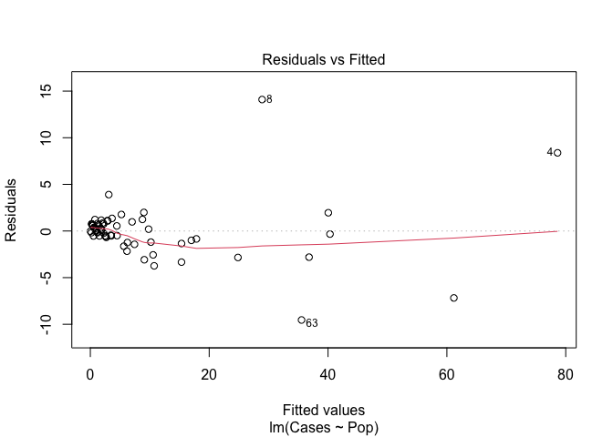<!-- -->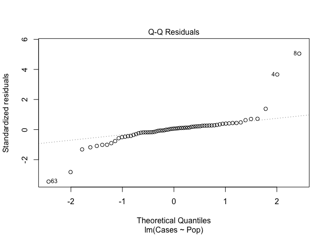<!-- -->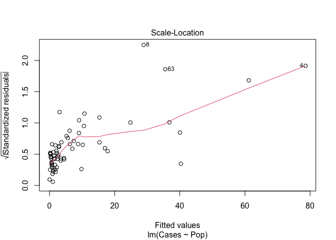<!-- -->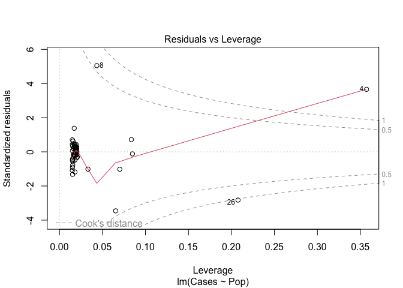<!-- -->

Although Resuduals vs Fitted values plot looks quite linear, it
definitely lacks of homogeneity of variance, which is seconded by the
Scale-Location plot. Normal Q-Q plot demonstrates few pretty extreme
outliers having standardized residuals’ value far more than ±2, which
affects the normality of residuals. Same four extreme points are
standing out on Residuals vs Leverage plot with Cook’s Distance around
level 0.5, 1 and far beyond level 1. We could suggest to remove these
data points to look if the normality and data influence would work with
the model better, or if we need to transform data to fit the model.

#### Shapiro test on the residuals

``` r
shapiro.test(nzair.lm$residuals)
```

    ## 
    ##  Shapiro-Wilk normality test
    ## 
    ## data:  nzair.lm$residuals
    ## W = 0.74502, p-value = 1.868e-09

Shapiro-Wilk test returned a significantly small p-value (1.868e-09)
which allows us to reject the null of normality of residuals. This
proves the conclusions made from diagnostic plots earlier.

#### A linear regression of Cases on Pop without an intercept.

``` r
nzair.lm0 = lm(Cases ~ 0 + Pop, NZAir)

summary(nzair.lm)
```

    ## 
    ## Call:
    ## lm(formula = Cases ~ Pop, data = NZAir)
    ## 
    ## Residuals:
    ##     Min      1Q  Median      3Q     Max 
    ## -9.5422 -0.6387  0.1822  0.7462 14.0951 
    ## 
    ## Coefficients:
    ##              Estimate Std. Error t value Pr(>|t|)    
    ## (Intercept) -0.191641   0.408683  -0.469    0.641    
    ## Pop          0.219256   0.005238  41.857   <2e-16 ***
    ## ---
    ## Signif. codes:  0 '***' 0.001 '**' 0.01 '*' 0.05 '.' 0.1 ' ' 1
    ## 
    ## Residual standard error: 2.854 on 65 degrees of freedom
    ## Multiple R-squared:  0.9642, Adjusted R-squared:  0.9637 
    ## F-statistic:  1752 on 1 and 65 DF,  p-value: < 2.2e-16

``` r
summary(nzair.lm0)
```

    ## 
    ## Call:
    ## lm(formula = Cases ~ 0 + Pop, data = NZAir)
    ## 
    ## Residuals:
    ##     Min      1Q  Median      3Q     Max 
    ## -9.5250 -0.8138  0.0023  0.5619 14.0735 
    ## 
    ## Coefficients:
    ##     Estimate Std. Error t value Pr(>|t|)    
    ## Pop 0.217974   0.004443   49.06   <2e-16 ***
    ## ---
    ## Signif. codes:  0 '***' 0.001 '**' 0.01 '*' 0.05 '.' 0.1 ' ' 1
    ## 
    ## Residual standard error: 2.837 on 66 degrees of freedom
    ## Multiple R-squared:  0.9733, Adjusted R-squared:  0.9729 
    ## F-statistic:  2407 on 1 and 66 DF,  p-value: < 2.2e-16

The p-value stayed the same, which indicates that both models works
well. However, the model without an intercept shows a bit of improvement
in the summary: Residual standard error got slightly less (from 2.854 to
2.837) and the R-squared increased (from 0.9642 to 0.9733), which means
that the model without an intercept explains more variability of Cases
(by ~1%).

### 2.

``` r
NZAir |> 
  mutate(sqrtCases = sqrt(Cases),
  sqrtPop = sqrt(Pop),
  logCases1 = log(Cases + 1),    
  logPop = log(Pop)) -> NZAir
```

#### Model A

``` r
nzair.lmA <- lm(sqrtCases ~ 1 + sqrtPop, data = NZAir)
```

``` r
summary(nzair.lmA)
```

    ## 
    ## Call:
    ## lm(formula = sqrtCases ~ 1 + sqrtPop, data = NZAir)
    ## 
    ## Residuals:
    ##      Min       1Q   Median       3Q      Max 
    ## -0.84942 -0.21345  0.02447  0.22976  1.26823 
    ## 
    ## Coefficients:
    ##             Estimate Std. Error t value Pr(>|t|)    
    ## (Intercept)  0.01867    0.07203   0.259    0.796    
    ## sqrtPop      0.45752    0.01129  40.519   <2e-16 ***
    ## ---
    ## Signif. codes:  0 '***' 0.001 '**' 0.01 '*' 0.05 '.' 0.1 ' ' 1
    ## 
    ## Residual standard error: 0.3603 on 65 degrees of freedom
    ## Multiple R-squared:  0.9619, Adjusted R-squared:  0.9613 
    ## F-statistic:  1642 on 1 and 65 DF,  p-value: < 2.2e-16

``` r
par(mfrow=c(2,2))
plot(nzair.lmA) 
```

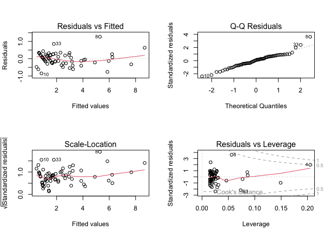<!-- -->

Estimating how many cases we would expect for a population the size of
Auckland’s North Shore (Population = 184812), and calculating a
prediction interval.

``` r
(predict(nzair.lmA, newdata = data.frame(sqrtPop = sqrt(184.812)), interval = "prediction"))^2
```

    ##        fit     lwr      upr
    ## 1 38.91816 30.1221 48.83947

``` r
NZAir[35,]
```

    ##       Location Cases     Pop PM10 sqrtCases  sqrtPop logCases1   logPop
    ## 35 North_Shore    40 184.812 16.3  6.324555 13.59456  3.713572 5.219339

The actual number of cases in North Shore is 40, which is quite close to
our predicted value (39) and completely falls into prediction interval
(from 30 to 49 cases) by this model.

#### Alternative regression Model B

``` r
nzair.lmB <- lm(logCases1 ~ 1 + logPop, data = NZAir)
summary(nzair.lmB)
```

    ## 
    ## Call:
    ## lm(formula = logCases1 ~ 1 + logPop, data = NZAir)
    ## 
    ## Residuals:
    ##      Min       1Q   Median       3Q      Max 
    ## -0.52380 -0.25204  0.01297  0.12076  0.62127 
    ## 
    ## Coefficients:
    ##             Estimate Std. Error t value Pr(>|t|)    
    ## (Intercept) -0.32827    0.07777  -4.221 7.71e-05 ***
    ## logPop       0.71422    0.02533  28.200  < 2e-16 ***
    ## ---
    ## Signif. codes:  0 '***' 0.001 '**' 0.01 '*' 0.05 '.' 0.1 ' ' 1
    ## 
    ## Residual standard error: 0.2879 on 65 degrees of freedom
    ## Multiple R-squared:  0.9244, Adjusted R-squared:  0.9233 
    ## F-statistic: 795.2 on 1 and 65 DF,  p-value: < 2.2e-16

``` r
par(mfrow=c(2,2))
plot(nzair.lmB) 
```

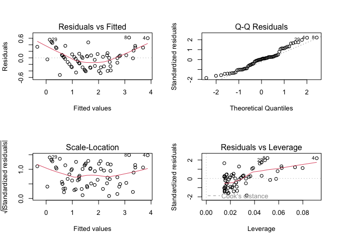<!-- -->

``` r
exp(predict(nzair.lmB, newdata = data.frame(logPop = log(184.812)), interval = "prediction")) - 1
```

    ##        fit      lwr      upr
    ## 1 28.94813 15.55726 53.16903

``` r
NZAir[35,]
```

    ##       Location Cases     Pop PM10 sqrtCases  sqrtPop logCases1   logPop
    ## 35 North_Shore    40 184.812 16.3  6.324555 13.59456  3.713572 5.219339

**Comparing two models**

Although both models perform well and have the same highly significant
p-values (\< 2.2e-16), Model A explains slightly more variability of
data than Model B (~96% vs. ~92%) and has a higher F-statistic, which
indicates that the Model A has a better overall fit. On the other hand,
Model B has a smaller Residual Standard Error than Model B (0.2879
vs. 0.3603) and resiaduals are more heteroscedastic on diagnostic plots.
Both models looks relatively linear on Q-Q Residuals plot and didn’t
show any points with Cook’s Distance more than level 0.5.

Since both models’ performance is quite close to each other, we could
use a prediction interval’s width to compare and decide which one to
use. Model A’s predicted value was really close to an actual data (39
vs. 40, with prediction width from 30 to 49 cases), whereas Model B
suggested a far more vague prediction with a predicted value 29 cases
and prediction width from 16 to 53. We may conclude that Model A fits
data a bit better and capable of making more accurate predictions than
Model B.

#### Visualising the effect of weight by plotting with symbol sizes proportional to Pop

``` r
plot(nzair.lmA$residuals ~ NZAir$sqrtPop, cex = sqrt(NZAir$Pop/10)) 
```

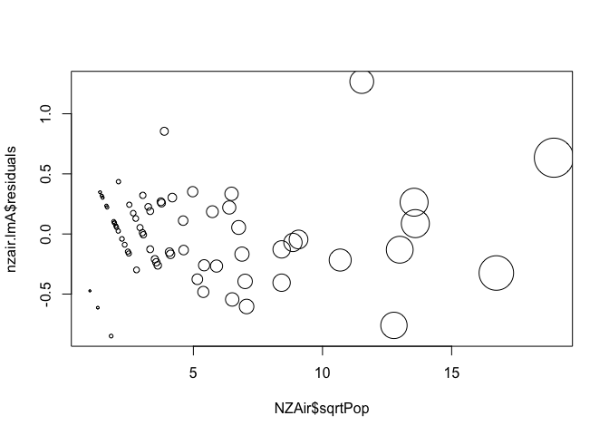<!-- -->

``` r
plot(nzair.lmB$residuals ~ NZAir$logPop, cex = sqrt(NZAir$Pop/10)) 
```

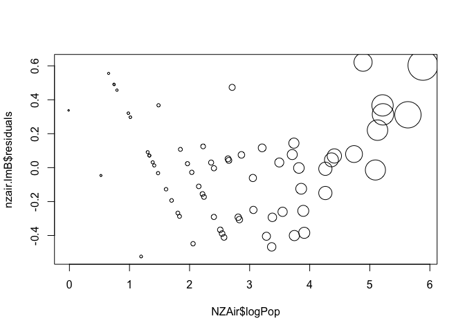<!-- -->

Both plots showed a decreasing linear patterns of residuals at the left
of the graphs, which might indicate of non-linearity of residuals. Model
B also has an increasing tail of residuals on the right side with
residuals being positive, which is also might be the indication that the
model needs to be improved.

### 3.

#### Linear regression with the variable PM10 (the mass of particulate matter (‘specks’) in the air).

``` r
nzair.lmC <- lm(sqrtCases ~ 1 + sqrtPop + PM10, data = NZAir)
summary(nzair.lmC)
```

    ## 
    ## Call:
    ## lm(formula = sqrtCases ~ 1 + sqrtPop + PM10, data = NZAir)
    ## 
    ## Residuals:
    ##      Min       1Q   Median       3Q      Max 
    ## -0.92319 -0.09848  0.01086  0.12328  0.77665 
    ## 
    ## Coefficients:
    ##              Estimate Std. Error t value Pr(>|t|)    
    ## (Intercept) -0.940773   0.118932  -7.910 4.64e-11 ***
    ## sqrtPop      0.465142   0.007683  60.542  < 2e-16 ***
    ## PM10         0.055191   0.006241   8.843 1.07e-12 ***
    ## ---
    ## Signif. codes:  0 '***' 0.001 '**' 0.01 '*' 0.05 '.' 0.1 ' ' 1
    ## 
    ## Residual standard error: 0.2436 on 64 degrees of freedom
    ## Multiple R-squared:  0.9829, Adjusted R-squared:  0.9823 
    ## F-statistic:  1835 on 2 and 64 DF,  p-value: < 2.2e-16

``` r
anova(nzair.lmA, nzair.lmC)
```

    ## Analysis of Variance Table
    ## 
    ## Model 1: sqrtCases ~ 1 + sqrtPop
    ## Model 2: sqrtCases ~ 1 + sqrtPop + PM10
    ##   Res.Df    RSS Df Sum of Sq      F    Pr(>F)    
    ## 1     65 8.4378                                  
    ## 2     64 3.7978  1      4.64 78.191 1.066e-12 ***
    ## ---
    ## Signif. codes:  0 '***' 0.001 '**' 0.01 '*' 0.05 '.' 0.1 ' ' 1

According to the summary results, the overall p-value of both models is
the same and significantly low (\< 2.2e-16), which shows that both
models are a good fit in general. However, we certainly may conclude
that additional covariate PM10 in the Model C improved the regression
comparing to the Model A and the covariate itself is highly significant
too (with p-value 1.07e-12).

We have a bigger R-squared in Model C compared to the Model A (0.9829
vs. 0.9619), which shows that that the former model explains more
variability of data. Also, Residual Standard Error of Model C is smaller
(0.2436 vs. 0.3603), which means that this model’s prediction width
would be narrower. And lastly, the ANOVA comparison of two models also
shows that Model C provides a better fit than model A with significantly
low p-value of 1.066e-12.

#### Standardised Residuals against sqrtPop, and Studentized Deleted Residuals against sqrtPop

``` r
n = length(NZAir$sqrtPop)
plot(rstudent(nzair.lmC) ~ NZAir$sqrtPop, pch = 3, col = 2, main = "Standardized(o) and Studentized(+) residuals vs sqrtPop")
points(rstandard(nzair.lmC) ~ NZAir$sqrtPop)
```

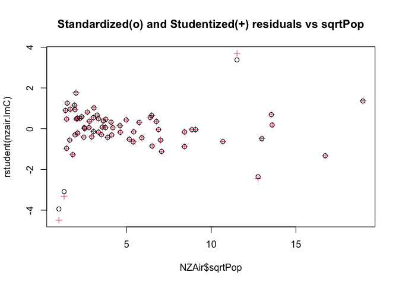<!-- -->

We plotted standardized and studentized residuals on the same plot to
see if any of deleted residuals had a significant influential leverage
and potentially would drug the line towards themselves.

#### 3 locations that have the biggest difference between the Standardized residuals and standardized deleted residuals.

``` r
cbind(1:n, sort(abs(rstudent(nzair.lmC) - rstandard(nzair.lmC)), decreasing = TRUE))
```

    ##    [,1]         [,2]
    ## 46    1 5.515105e-01
    ## 8     2 3.185886e-01
    ## 2     3 2.330959e-01
    ## 63    4 9.000038e-02
    ## 37    5 2.910545e-02
    ## 4     6 9.223545e-03
    ## 26    7 8.143254e-03
    ## 10    8 6.324037e-03
    ## 14    9 5.678399e-03
    ## 61   10 3.030219e-03
    ## 34   11 3.025883e-03
    ## 11   12 3.025540e-03
    ## 66   13 3.017560e-03
    ## 52   14 3.010262e-03
    ## 17   15 2.991607e-03
    ## 30   16 2.981836e-03
    ## 38   17 2.980756e-03
    ## 53   18 2.975244e-03
    ## 7    19 2.972753e-03
    ## 15   20 2.967168e-03
    ## 20   21 2.954403e-03
    ## 60   22 2.930840e-03
    ## 43   23 2.924554e-03
    ## 47   24 2.918044e-03
    ## 5    25 2.904629e-03
    ## 22   26 2.878287e-03
    ## 3    27 2.860691e-03
    ## 9    28 2.857356e-03
    ## 62   29 2.821907e-03
    ## 54   30 2.755077e-03
    ## 33   31 2.739137e-03
    ## 28   32 2.701175e-03
    ## 45   33 2.651166e-03
    ## 65   34 2.565442e-03
    ## 19   35 2.499724e-03
    ## 48   36 2.414938e-03
    ## 59   37 2.250071e-03
    ## 32   38 2.198312e-03
    ## 50   39 2.197342e-03
    ## 56   40 2.192504e-03
    ## 64   41 2.174349e-03
    ## 57   42 2.172846e-03
    ## 24   43 2.138188e-03
    ## 18   44 1.840404e-03
    ## 1    45 1.624715e-03
    ## 39   46 1.562357e-03
    ## 29   47 1.410244e-03
    ## 35   48 1.379316e-03
    ## 41   49 1.351268e-03
    ## 36   50 1.281958e-03
    ## 51   51 1.230756e-03
    ## 40   52 1.195573e-03
    ## 6    53 1.157024e-03
    ## 21   54 1.096074e-03
    ## 44   55 9.191873e-04
    ## 58   56 6.301035e-04
    ## 13   57 5.912962e-04
    ## 67   58 5.686391e-04
    ## 16   59 4.241244e-04
    ## 55   60 4.104178e-04
    ## 49   61 3.888054e-04
    ## 25   62 3.860057e-04
    ## 42   63 3.577261e-04
    ## 12   64 3.561115e-04
    ## 23   65 3.537861e-04
    ## 27   66 3.437584e-04
    ## 31   67 8.243403e-05

``` r
NZAir$Location[c(46, 8, 2)]
```

    ## [1] "Reefton"            "Christchurch_Inner" "Arrowtown"

``` r
NZAir.removed <- NZAir[-c(46, 8, 2),]
nzair.lmC2 <- lm(sqrtCases ~ 1 + sqrtPop + PM10, data = NZAir.removed)
summary(nzair.lmC2)
```

    ## 
    ## Call:
    ## lm(formula = sqrtCases ~ 1 + sqrtPop + PM10, data = NZAir.removed)
    ## 
    ## Residuals:
    ##      Min       1Q   Median       3Q      Max 
    ## -0.46343 -0.11001 -0.00244  0.09241  0.43453 
    ## 
    ## Coefficients:
    ##              Estimate Std. Error t value Pr(>|t|)    
    ## (Intercept) -0.894903   0.083288  -10.74 1.06e-15 ***
    ## sqrtPop      0.453185   0.005371   84.38  < 2e-16 ***
    ## PM10         0.056938   0.004432   12.85  < 2e-16 ***
    ## ---
    ## Signif. codes:  0 '***' 0.001 '**' 0.01 '*' 0.05 '.' 0.1 ' ' 1
    ## 
    ## Residual standard error: 0.1638 on 61 degrees of freedom
    ## Multiple R-squared:  0.9915, Adjusted R-squared:  0.9912 
    ## F-statistic:  3562 on 2 and 61 DF,  p-value: < 2.2e-16

Even though the difference between Standardized and Studentized
residuals of those 3 Locations with maximum difference wasn’t that huge
and points were located pretty close to each other, Model C2 with those
locations removed provides a noticeable improvemet to the regression.
R-squared got a bit larger than in Model C (0.9915 vs. 0.9829), Residual
Standard Error became a lot smaller (0.1638 vs. 0.2436) and the p-value
of covariate PM10 became even smaller (\< 2e-16 vs. 1.07e-12). Model C2
definitely fit the data better comparing to the Model C, therefore I
would assume that removing those rows would make sense.

#### Leverages against sqrtPop

``` r
n = length(NZAir$Cases)
p = 3

plot(hatvalues(nzair.lmC) ~ NZAir$sqrtPop, pch = "" )
text(hatvalues(nzair.lmC) ~ NZAir$sqrtPop, labels = NZAir$Location)
```

<!-- -->

#### Adding a horizontal reference line for high leverage.

``` r
n = length(NZAir$Cases)
p = 3

plot(hatvalues(nzair.lmC) ~ NZAir$sqrtPop, pch = "", main = "Leverages of locations vs. (sqrt)Population")
text(hatvalues(nzair.lmC) ~ NZAir$sqrtPop, labels = NZAir$Location)

abline(h = (3 * p/n))
```

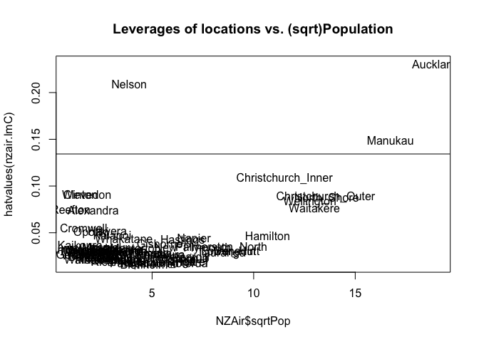<!-- -->

#### Points with high leverage because of population and Points with high leverage because of PM10

``` r
n = length(NZAir$Cases)
p = 3

plot(hatvalues(nzair.lmC) ~ NZAir$PM10, pch = "", main = "Leverages of locations vs. PM10")
text(hatvalues(nzair.lmC) ~ NZAir$PM10, labels = NZAir$Location)
abline(h = (3 * p/n))
```

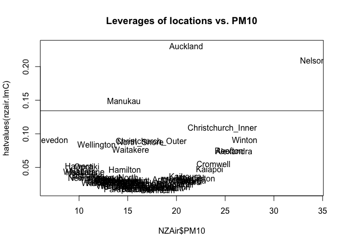<!-- -->

The graph of Leverages vs. Population indicates that leverage is most
possibly explained by high values of Population. The second graph
indicates that high leverage is also related to PM10, which is why
Nelson with average population value has high leverage because of it’s
extremely high PM10 value. I would assume that leverage depends on both
predictors in combination.

#### Added variable plot for Cases vs PM10 after adjusting each variable for Pop

``` r
e = lm(sqrtCases ~ sqrtPop, data = NZAir)$residuals
f = lm(PM10 ~ sqrtPop, data = NZAir)$residuals
plot(e ~ f, main = "Partial Regression Plot for Cases vs PM10, adjusted for Population")
lines(lowess(e ~ f))
```

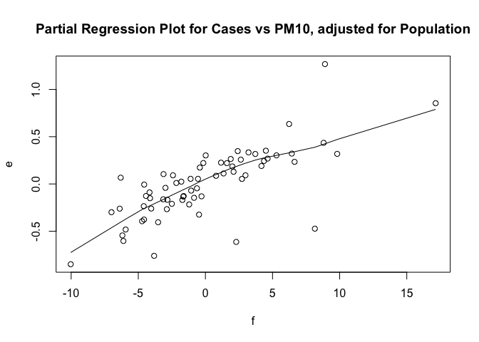<!-- -->

``` r
summary(lm(e ~ f))
```

    ## 
    ## Call:
    ## lm(formula = e ~ f)
    ## 
    ## Residuals:
    ##      Min       1Q   Median       3Q      Max 
    ## -0.92319 -0.09848  0.01086  0.12328  0.77665 
    ## 
    ## Coefficients:
    ##              Estimate Std. Error t value Pr(>|t|)    
    ## (Intercept) 9.133e-18  2.953e-02   0.000        1    
    ## f           5.519e-02  6.193e-03   8.911  7.1e-13 ***
    ## ---
    ## Signif. codes:  0 '***' 0.001 '**' 0.01 '*' 0.05 '.' 0.1 ' ' 1
    ## 
    ## Residual standard error: 0.2417 on 65 degrees of freedom
    ## Multiple R-squared:  0.5499, Adjusted R-squared:  0.543 
    ## F-statistic: 79.41 on 1 and 65 DF,  p-value: 7.095e-13

We observe a quite strong increasing trend with a few outliers, which
seem to not deform the regression. The line appears to be slightly
curved, but we can say that there’s a straight line relationship of
Cases on the effect of PM10

``` r
summary(lm(e ~ f))$r.squared
```

    ## [1] 0.5499025

The additional variable PM10 have explained about 54.9% of the
previously unexplained variation. That is an additional 2.1% out of 3.8%
that was left after the Cases vs. sqrtPop model.
